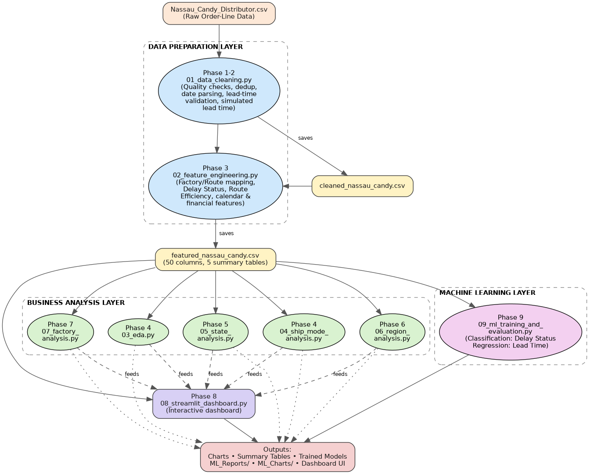
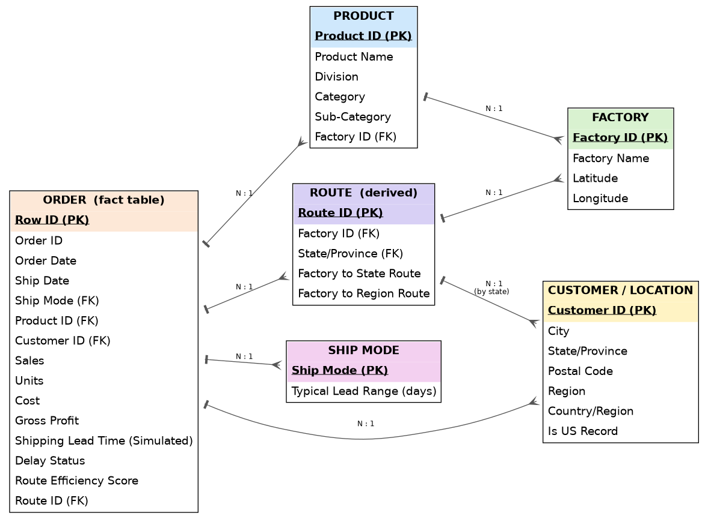

<div align="center">

# 🍬 Factory-to-Customer Shipping Route Efficiency Analysis

### A Data Analytics, Business Intelligence & Machine Learning Project on the Nassau Candy Distributor Dataset

[](https://www.python.org/)
[](https://streamlit.io/)
[](https://scikit-learn.org/)
[](LICENSE)
[]()

**End-to-end analytics workflow — from raw data cleaning and feature engineering to exploratory analysis, business intelligence reporting, an interactive dashboard, and machine learning model training — built to evaluate and optimize factory-to-customer shipping operations across the United States and Canada.**

[🌐 Live Dashboard](https://factsatyamp-eivrfhwlvsznxv2zlpkjhu.streamlit.app/) · [📂 Project Structure](#-project-structure) · [🤖 ML Results](#-phase-9--machine-learning) · [🚀 Getting Started](#-how-to-run-the-project)

</div>

---

## 📖 Project Overview

Efficient logistics and transportation management are critical for large-scale distributors. Shipping delays, inefficient routes, and regional bottlenecks can significantly impact customer satisfaction, operational cost, and overall business performance.

This project analyzes shipping operations for the **Nassau Candy Distributor** and answers key business questions such as:

- Which shipping routes are the most efficient?
- Which routes experience frequent delays?
- Which states and regions have poor shipping performance?
- How does ship mode affect delivery speed and profitability?
- Which factories perform best operationally?
- Can shipment delays be predicted using machine learning?

The project converts raw shipment records into meaningful business insights and predictive analytics that support data-driven logistics decisions.

---

## 🌐 Live Dashboard

🚀 Explore the live interactive dashboard here:

**👉 [factsatyamp-eivrfhwlvsznxv2zlpkjhu.streamlit.app](https://factsatyamp-eivrfhwlvsznxv2zlpkjhu.streamlit.app/)**

---

## 🎯 Project Objectives

<table>
<tr>
<td valign="top" width="50%">

**Business Objectives**
- Improve shipping efficiency
- Identify logistics bottlenecks
- Reduce shipment delays
- Compare performance across factories
- Evaluate regional and state-level performance
- Analyze shipping mode effectiveness
- Support operational decision-making

</td>
<td valign="top" width="50%">

**Technical Objectives**
- Perform large-scale data cleaning
- Engineer business-focused features
- Conduct exploratory data analysis
- Build interactive business dashboards
- Develop predictive machine learning models
- Generate executive-level reports and recommendations

</td>
</tr>
</table>

---

## 🏗 Project Architecture

The pipeline flows through four layers — data preparation, business analysis, machine learning, and delivery (dashboard + reports) — as shown below.



<details>
<summary>Text-only version</summary>

```text
Raw Dataset
      │
      ▼
Data Cleaning
      │
      ▼
Feature Engineering
      │
      ▼
Exploratory Data Analysis
      │
      ▼
Business Analytics
 ├─ Ship Mode Analysis
 ├─ State Analysis
 ├─ Region Analysis
 └─ Factory Analysis
      │
      ▼
Interactive Dashboard
      │
      ▼
Machine Learning
      │
      ▼
Business Recommendations
```

</details>

---

## 🗂 Entity Relationship Diagram

The featured dataset is conceptually organized around one fact table (**Order**) linked to **Product**, **Factory**, **Customer/Location**, **Ship Mode**, and a derived **Route** entity.



---

## 📂 Project Structure

```text
Factory-to-Customer-Shipping-Route-Efficiency-Analysis/
│
├── 01_data_cleaning.py
├── 02_feature_engineering.py
├── 03_exploratory_data_analysis.py
├── 04_ship_mode_analysis.py
├── 05_state_analysis.py
├── 06_region_analysis.py
├── 07_factory_analysis.py
├── 08_streamlit_dashboard.py
├── 09_ml_training_and_evaluation.py
│
├── Nassau_Candy_Distributor.csv
├── cleaned_nassau_candy.csv
├── featured_nassau_candy.csv
│
├── docs/
│   ├── architecture_diagram.png
│   └── er_diagram.png
│
├── EDA_Charts/
├── EDA_Summaries/
│
├── ML_Charts/
├── ML_Reports/
├── ML_Models/
│
└── README.md
```

---

## 🔍 Phase 1 — Data Cleaning

The first stage transforms raw shipment data into a reliable analytical dataset.

**Tasks Performed**
- Dataset inspection
- Missing value analysis
- Duplicate record detection
- Date validation and conversion
- Shipping lead time calculation
- Invalid shipment record handling
- Data consistency checks

**Output:** `cleaned_nassau_candy.csv`

---

## ⚙️ Phase 2 — Feature Engineering

Business-oriented features are generated to support advanced analytics and machine learning.

| Category | Features Created |
|---|---|
| **Logistics** | Shipping Lead Time · Delay Status · Route Efficiency Score |
| **Geographic** | Factory Mapping · Factory Coordinates · State Information · Regional Classification |
| **Time** | Order Month · Order Quarter · Seasonal Indicators |
| **Business Metrics** | Profit Margin % · Shipment Volume Metrics · Route Performance Indicators |

**Output:** `featured_nassau_candy.csv`

---

## 📊 Phase 3 — Exploratory Data Analysis

Comprehensive EDA is performed to understand data patterns and uncover operational insights.

| Category | Analysis Performed |
|---|---|
| **Data Quality** | Missing values · Outlier detection · Distribution analysis |
| **Sales** | Revenue distribution · Profit analysis · Product performance |
| **Shipping** | Lead time distribution · Delay patterns · Efficiency evaluation |
| **Geographic** | State-wise performance · Regional performance · Route effectiveness |

**Deliverables:** high-quality visualizations, summary tables, business insights, executive-level observations.

---

## 🚚 Phase 4 — Ship Mode Performance Analysis

Evaluates shipping performance across delivery methods: **Same Day, First Class, Second Class, Standard Class.**

**Key Metrics:** average lead time · delay percentage · shipment volume · revenue contribution · profitability · route efficiency

**Business Outcome:** identify the most efficient and cost-effective shipping strategy.

---

## 🗺 Phase 5 — State-Level Analysis

State-wise shipping performance analysis to identify geographic bottlenecks — top/poor-performing states, delay hotspots, revenue contribution, and route efficiency rankings.

**Business Outcome:** identify states requiring logistics optimization.

---

## 🌎 Phase 6 — Region-Level Analysis

Regional shipping performance evaluated for lead times, delays, revenue, profitability, and route efficiency.

**Business Outcome:** identify underperforming regions and strategic improvement opportunities.

---

## 🏭 Phase 7 — Factory-Level Analysis

Factory performance analyzed for shipment volume, revenue, profit, delay frequency, route efficiency, and regional coverage.

**Business Outcome:** identify best-performing and underperforming factories.

---

## 📈 Phase 8 — Interactive Streamlit Dashboard

An interactive business intelligence dashboard built with Streamlit.

**Dashboard Features**
- **Executive Summary** — high-level KPIs, operational overview
- **Ship Mode Analytics** — delivery performance, delay trends
- **Geographic Analytics** — state and region analysis
- **Factory Analytics** — factory comparison, efficiency metrics
- **Interactive Filters** — region, state, factory, ship mode

**Run locally:**
```bash
streamlit run 08_streamlit_dashboard.py
```

---

## 🤖 Phase 9 — Machine Learning

Predictive models forecast shipping performance across two tasks.

### Classification — Delay Status
**Classes:** On Time · Moderate Delay · Delayed
**Models:** Logistic Regression · Decision Tree · Random Forest · Gradient Boosting

### Regression — Shipping Lead Time
**Models:** Linear Regression · Decision Tree · Random Forest · Gradient Boosting

### Evaluation Metrics
| Classification | Regression |
|---|---|
| Accuracy, Precision, Recall, F1 Score, ROC-AUC, Confusion Matrix | MAE, RMSE, R² Score, MAPE |

> 📌 Both targets are derived from a clearly labelled **simulated** shipping lead time, since the raw `Ship Date` field was found to be corrupted for effectively all records during Phase 1 data-quality checks. This substitution is documented and flagged throughout the pipeline outputs.

---

## 🛠 Technologies Used

| Category | Tools |
|---|---|
| **Language** | Python |
| **Data Analysis** | Pandas, NumPy |
| **Visualization** | Matplotlib, Seaborn, Plotly |
| **Dashboard** | Streamlit |
| **Machine Learning** | Scikit-Learn, SciPy, Joblib |

---

## 🚀 How to Run the Project

**1. Clone the repository**
```bash
git clone https://github.com/satyam-ssingh/Factory-to-Customer-Shipping-Route-Efficiency-Analysis
cd Factory-to-Customer-Shipping-Route-Efficiency-Analysis
```

**2. Install dependencies**
```bash
pip install -r requirements.txt
```

**3. Run the pipeline in order**
```bash
python 01_data_cleaning.py
python 02_feature_engineering.py
python 03_exploratory_data_analysis.py
python 04_ship_mode_analysis.py
python 05_state_analysis.py
python 06_region_analysis.py
python 07_factory_analysis.py
python 09_ml_training_and_evaluation.py
```

**4. Launch the dashboard**
```bash
streamlit run 08_streamlit_dashboard.py
```

---

## 📌 Key Outcomes

- ✅ End-to-end data analytics pipeline
- ✅ Business intelligence reporting
- ✅ Logistics performance evaluation
- ✅ Route efficiency analysis
- ✅ Geographic bottleneck detection
- ✅ Factory performance benchmarking
- ✅ Interactive dashboard development
- ✅ Predictive machine learning models
- ✅ Actionable business recommendations

---

## 👨‍💻 Author

**Satyam Kumar Singh**
*BCA Student · Data Analytics · Machine Learning · Business Intelligence*

Passionate about solving real-world business problems using data analytics, visualization, and machine learning.

📧 satyamsinghb45@gmail.com

---

<div align="center">

⭐ **If you found this project useful, consider giving the repository a star.**

</div>
